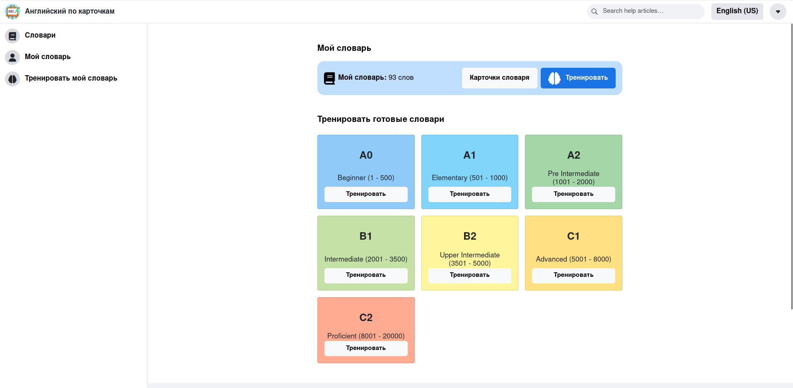
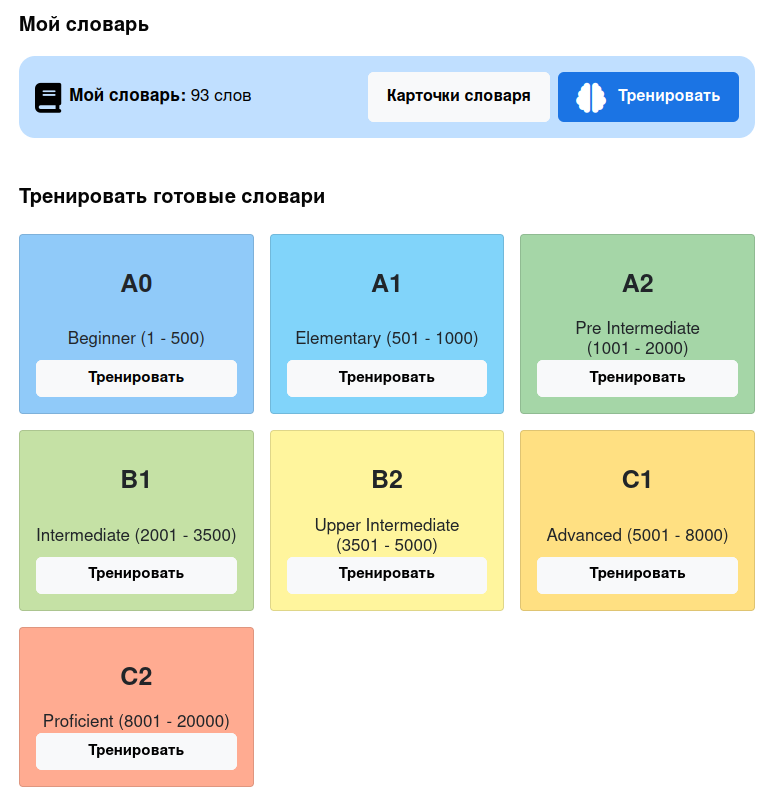
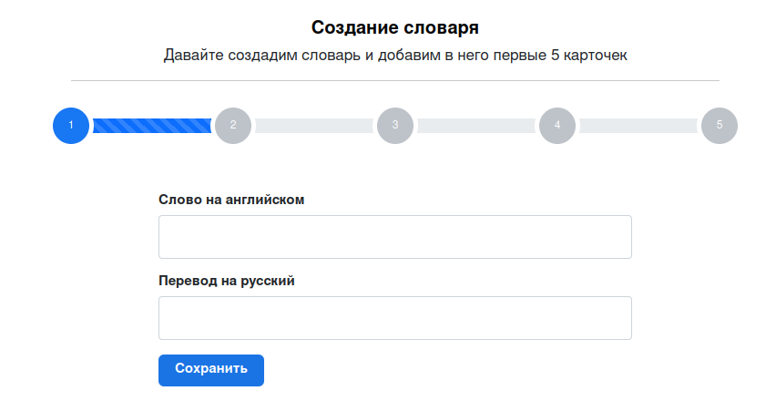
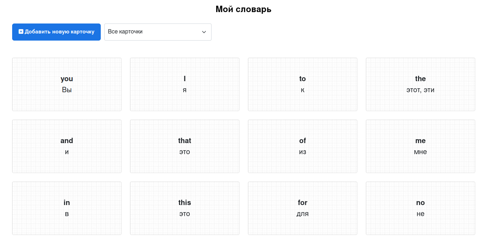
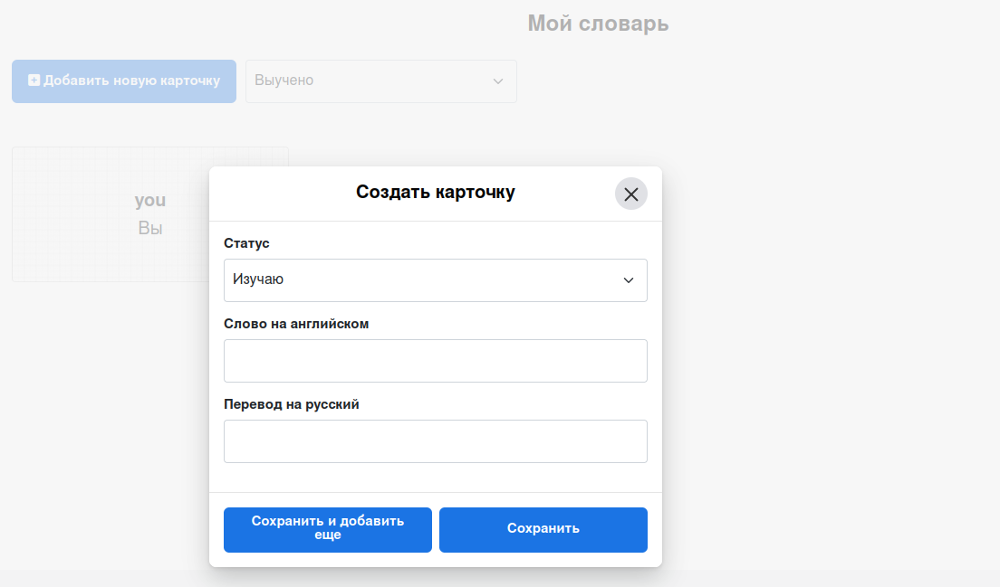
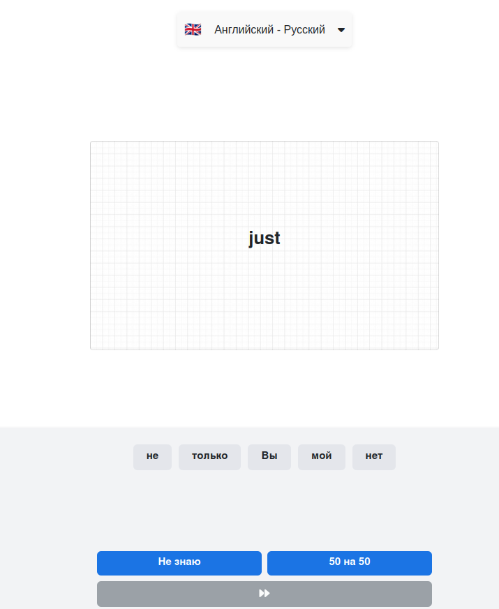
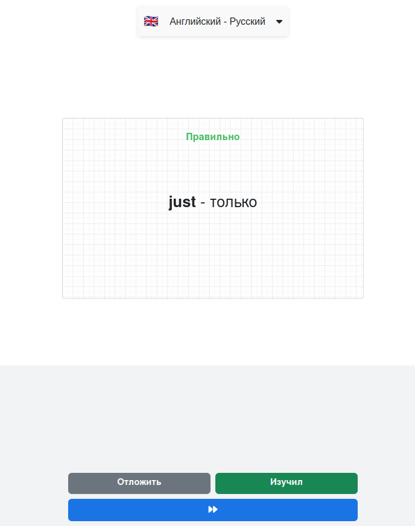
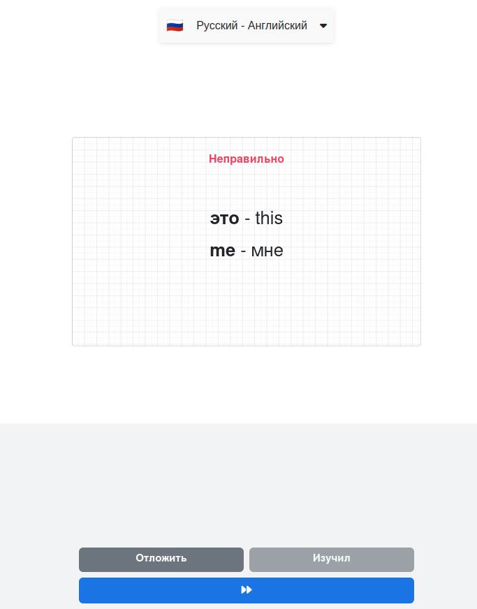

# ENG CARDS LEARN

### Сервис для изучения английского по карточкам

Ссылка: https://eng-cards.vim-store.ru/

## Функционал

Можно тренировать слова уже из готовых словарей, а также создать свой словарь со своими словами.

### Создание своего словаря

  
  

### Редактирование/удалениея карточек и добавление новых всловарь

### Тренировка карточек
В тренажере можно тренировать карточки. Есть возможность выбора направления - с русского на английский или наоборот.
Реализованы варианты ответов, кнопка "50 на 50" (остается только 2 варианта ответа), кнопка "Не знаю" - будет показан правильный ответ.
После ответа - если перевод указан пользователем неверно - отобразит ошибку и покажет правильный вариант.
Также при правильном ответе - можно пометить слово как изучение.

  
  

